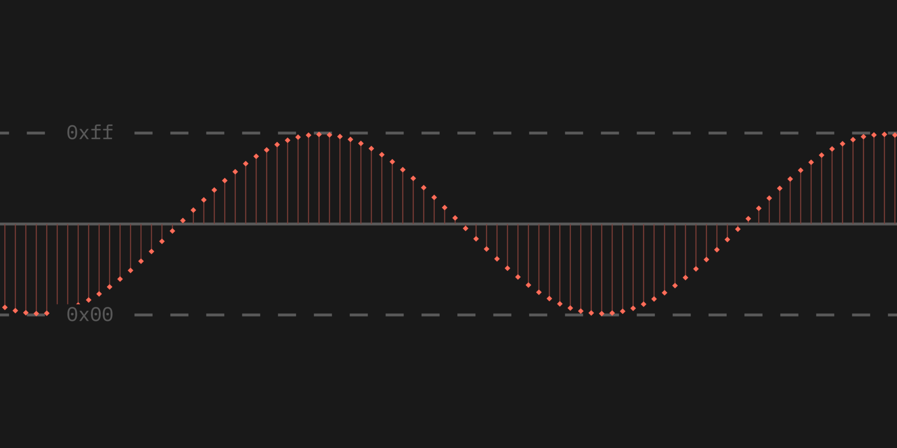

# Chiptune assignment

This is an assignment about sound waves that I made for classmates in my programming class.

This branch contains the solutions and support files I made while working on the assignment. **If you want to do the assignment yourself, look in the `public` branch.**