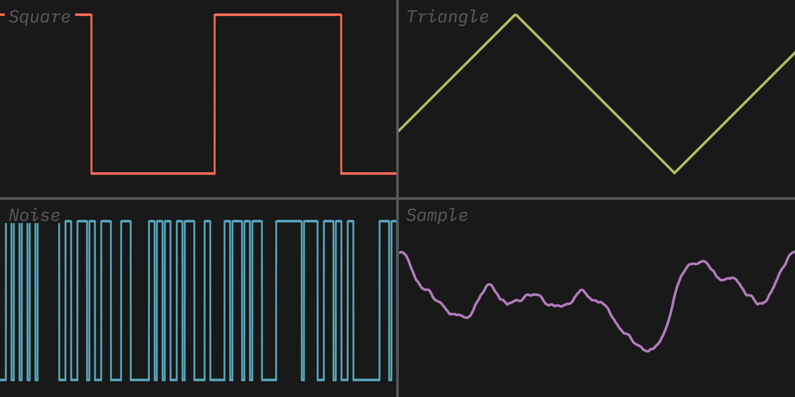
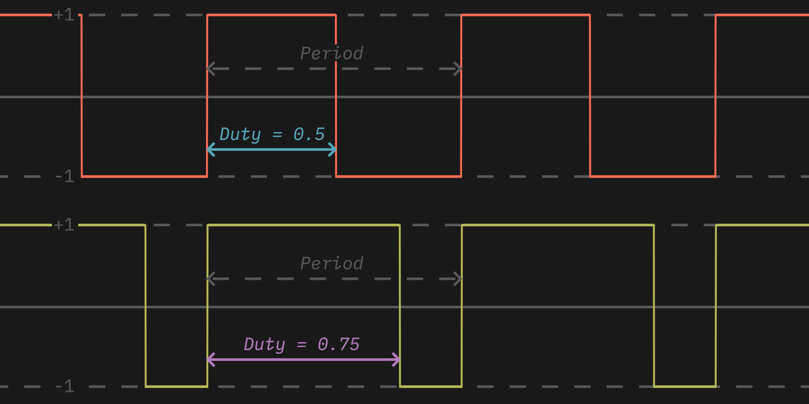

# Sound Synthesis

> **Note:** The first three sections provide a lot of useful background information. There is a summary before section 4, but unless you are already comfortable with the theory behind digital sound, I think you should read them.

# 1. Basics of Sound

Sound is the way that we experience changes in air pressure. Pressure changes that happen in a repeating pattern are heard as tones, while random, unpredicable changes in pressure are heard as static noise. 

A tone can be measured by its *frequency* and its *amplitude*. The frequency affects the pitch that we hear, and is measured in *hertz (Hz)*, or cycles per second. Most people can only hear sounds between 20 Hz and 20,000 Hz. 

The amplitude affects how loud the sound is. Physical loudness is measured in *decibels (dB)*, but in the digital realm, amplitude is usually measured relative to the maximum volume, either as *decibels below full scale (dBfs)* or as a simple percentage. Note that mathematically, wave amplitudes are almost always measured from -1 to +1, which allows for handy mathematical operations such as combining two sounds by simply adding their waveforms values.

The actual shape of the waveform also affects the sound, regardless of frequency and amplitude. We hear a sine wave as a "pure" tone, and all other sounds can be made by combining multiple sine waves. You can easily tell a piano apart from a guitar even if they are playing the same note, since they have completely different waveforms. How a given waveform sounds is called its *timbre* (pronounced *tamber*).

So, to recap, using these three qualities, you can describe any sound:

|Perceptual|Physical|Measurement|
|----------|--------|-----------|
|Pitch|Frequency|Hz|
|Loudness|Amplitude|dB (or relative unit)|
|Timbre|Waveform|*N/A*|

# 2. Digital Audio

To record and store sound in a computer, we simply need to capture many samples of air pressure, which can then be recreated with a speaker. Typically, audio is sampled at 44,100 samples per second, which allows us to record any sound that the average person can hear.

Each sample has to be stored in a certain number of bits, with 16, 24, and 32 bits being common. Increasing the sample rate or bit depth will increase audio quality, but it will also increase the file size. On old game consoles, recorded audio would take up far too much space, so games generated music and sound effects in real-time instead.

Generating audio mathematically from scratch is called *synthesis*, and is the basis of lots of interesting music and sound design. Modern systems can synthesize almost any sound directly on the CPU, but older systems required dedicated sound chips that would turn basic note instructions into sounds. The sound chip of these older computers and game consoles fully dictated what sort of audio could be played from them. This style of chip-based music synthesis has lived on as the *chiptune* music genre, often using or recreating specific sound chips from old game consoles.

# 3. The Ricoh 2A03 Chip

The NES used a chip called the 2A03, which has multiple jobs on the console, including audio synthesis. It has 5 audio channels:

- Two **pulse** channels, which can each produce a *square wave* at various *duty cycles*. A square wave jumps directly from -1 to +1 amplitude (and back again) each cycle. The duty cycle controls what percent of the cycle is spent at -1 vs +1. 

	The pulse channels were usually used for the lead (main) instruments in a song, since there were two of them, which allowed for chords and other flexibilty. The 2A03 has 4 different duty cycle options: 12.5%, 25%, 50%, and 75%. However, due to the way that sound works, the 25% and 75% options actually sound identical to each other.

- A **triangle** channel, which smoothly transitions from -1 to +1 and back again each cycle in a zig-zag shape.

	A triangle wave has some similar properties to a sine wave, so this channel was often used for basslines and other low tones that would sound too buzzy in a pulse wave. It could also be used to create punchy drum effects. On the original hardware, this had a slightly buzzy sound due to being limited to 4-bit output. Additionally, the volume couldn't be changed due to the low bit depth.

- A **noise** channel, which uses a *linear-feedback shift register (LFSR)* to generate a random static sound. This can operate in two different modes, with one of them producing a much more more tonal sound.

	The noise channel was mostly used for drums and some sound effects. Due to the simple way the random numbers are generated, it has a distinctive "metallic" sound, which is especially prominent in the alternate mode.

- A **sample** channel, which can play very short pre-recorded audio snippets, such as drums or specific instruments. 

	The sample channel was mostly used for small sound effects or instruments, such as more realistic drums or basslines. The use of this was somewhat limited, since audio data took up a lot of space on the 40 kB game cartriges.

You can see a demonstration of these channels [here](https://www.youtube.com/watch?v=gKXGDuKrCfA).

# (*Summary of Background Info*)

- Sound is changes in air pressure. Sound waves that repeat rapidly are heard as tones, while sound waves that are random and non-repetitve are heard as static noise.

- Repeating sound waves can be characterized by their frequency, amplitude, and waveform. Frequency affects pitch, amplitude affects loudness, and waveform affects timbre.

- Sound is stored in computers as collections of air pressure samples. Typically these samples range from -1 to +1 for mathematical reasons. Increasing the number of samples or the number of bits per sample increases quality but also increases file size.

- Due to storage limitations, old games synthesized sounds from scratch rather than storing prerecorded audio. The sounds that could be made were heavily limited by the hardware sound chips on the console.

- The chip that we'll be using is the Ricoh 2A03 from the NES. It has 5 channels: two **pulse** channels, a **triangle** channel, a **noise** channel, and a **sample** channel.

# 4. The Assignment

For this assignment, you will recreate one (or more!) of the sound channels from the 2A03 (but not the sample channel, since it doesn't synthesize any new sounds). You will start with base code that provides the setup for creating a synthesizer that can output sounds.

## Tour of the base code:

- The top of the file imports some libraries and defines some constants.

- The `Sampler` class is a base class that contains parameters for a specific synthesizer, and declares a function that is called to determine the value of a sample. The samplers are written as a class rather than a plain function so that they can perserve internal state between samples, which is needed for the LFSR noise channel.

- The example `SineSampler` class, which inherits from sampler, creates a pure sine wave. It does some math to do the following:
	- convert the sine wave's domain from `0..2π` to the expected range of `0..1`
	- make the sine wave the desired frequency
	- apply the correct volume multiplier

- The main function constructs an instance of a `SineSampler` with a frequency of 261.6 Hz, which is middle C. Then it opens a file called `out.wav` for editing and sets up its parameters, and fills the data of the file using the sampler's `sample` method. It also does some math to transform the `-1..+1` range output by the sampler into the `0..255` range expected by the `wave` module.

If you run the code, you should get a file called `out.wav` that you can play to hear the sine wave that was generated.

## Your task:

Pick one of the three synthesizer channels from the 2A03 chip (pulse, triangle, or noise), and look at the [channel descriptions](#channel-descriptions) section below to see exactly how it works. Then, write a new class that inherits from `Sampler`, and write its `sample` method to output the correct waveform. To test your code, make the `sampler` variable in the main function an instance of your class, instead of a `SineSampler`. You can use software such as [Audacity](https://www.audacityteam.org/download/) if you want to visually check whether the waveform is correct.

## Channel descriptions:

For all channels, remember that each cycle should last `1 / self.frequency` seconds, and that the output of `sample` should be multiplied by `self.volume`.

**Pulse:** 

This channel jumps directly from -1 to +1 every cycle, so if it starts at +1, it should jump to -1 partway through the cycle, and then back to +1 at the start of the next cycle. You should add a variable to your class to store the duty cycle variable, which is a percentage from 0 to 1. The duty cycle controls when in the cycle the value changes from +1 to -1. At a duty cycle of 0.5, the wave spends an equal amount of time at -1 and +1, whereas at a duty cycle of 0.25, the wave spends 25% of the time at +1 and 75% of the time at -1 each cycle.

**Triangle:**

This channel is fairly simple; it varies in a straight line from +1 to -1 and then back again over the course of a cycle. 

**Noise:**

The noise channel is probably the most complicated one. It creates static noise, which is just a sequence of random numbers. If you want, you can just generate those using the `random` library. However, for a more NES-like sound, we'll use a linear-feedback shift register, which is a simple way of using bitwise math to generate those random numbers. 

Start by making a variable on your class to store the register. It doesn't really matter what value it starts with, as long as it's an `int`. To get the next value in the sequence: xor the two right-most bits together, and put the result into the fifteenth bit (from the right) of the register. Then, right-shift entire register by one bit, and use the right-most bit as the new value.

For an extra challenge, consider using `self.frequency` to only generate a new value on certain samples, rather than every time `sample` is called.

## Extra things to try:

When you are finished, you can try the following:

- Implement one or both of the other waveforms

- Make a sequence of notes that makes a cool sound

- Invent a way to write and play simple songs

- Create a graphical interface to play with the synth parameters

# Appendix

## Bitwise math tips:

Here are a few handy formulas to help with the bitwise math needed for the noise channel:

*For the following section, `a` and `b` are integers containing the bits that are being operated on, and `n` is an integer designating the number of bits to shift.*

|Name|Syntax|
|----|--------|
|bitwise AND|`a & b`|
|bitwise OR|`a \| b`|
|bitwise XOR|`a ^ b`|
|left shift|`a >> n`|
|right shift|`a << n`|
|binary literal|`0b1010`|

**Get the right-most bit:** `a & 1`

**Get the `n`th bit from the right:** `a >> n & 1`

**Get the `n` right-most bits:** `a & (1 << n) - 1`

**Set the `n`th bit from the right to `b`** (make sure that `b` is only 0 or 1): `(a & (1 << n) - 1) | (b << n)`

## Interactive audio with pygame:

If you want to play sounds in real time, you can use `pygame.mixer`'s [`Sound`](https://www.pygame.org/docs/ref/mixer.html#pygame.mixer.Sound) type. Instead of writing the data to a file (lines 43 to 48; "`with wave.open`" to "`file.writeframes(data)`"), you can construct a `Sound` object using the `data` buffer, and then call its `play` method. This means you can generate sounds on the fly based on the user's input, and play it back instantly.

## Further reading:

- The Pan Docs is an incredibly thorough and well-made set of information about the game boy; you can read the audio specifications [here](https://gbdev.io/pandocs/Audio_details.html).

- The youtube channel Dave Wave has an short but excellent series how you can build sounds out of basic waves; [here's](https://youtube.com/playlist?list=PLrnjie9klQEkZGar3zZ4hRurU_kUDk7Md) the playlist.

- The audio software company Ableton has a great [interactive guide](https://learningsynths.ableton.com/) to how synthesizers are used by musicians to create interesting sounds.

- This in-depth [interactive article](https://ciechanow.ski/sound/) by Bartosz Ciechanowski teaches the physics of sound, starting from air pressure and building up to waves, the doppler effect, and reverb.